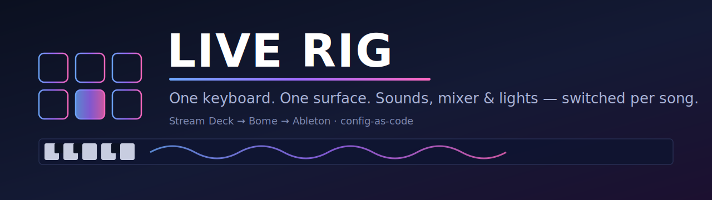

<p align="center">
  
</p>

<p align="center">
  
  
  
  
  
</p>

<p align="center">
  <b>How I run keys for a 4-piece original pop-rock band.</b><br>
  One MacBook, one keyboard, a couple of Stream Decks — sounds, mixer and stage lights driven
  from a single surface, switching automatically per song.
</p>

---

## 🎯 The idea

On stage I don't touch the laptop. Every song needs different sounds, a different mixer scene,
sometimes different lighting — and it happens in **one button press**. The rig is:

- **Centralized** — one surface drives sounds + mixer + lights
- **Song-aware** — one profile per song, switched automatically
- **Config-as-code** — the wired state is versioned in git, backed up three ways
- **Recoverable** — a bad update or a dead SD card doesn't cost me a gig

## 🔀 Signal flow

```
     Keyboard ──► MacBook / Ableton Live ──audio──► XR18 mixer ──► PA / IEM
                       ▲  (Omnisphere, Keyscape, B-3X)   ▲
                       │ MIDI                            │ scene per song
                 ┌─────┴──────┐                          │
                 │ Bome MIDI  │◄──── MIDI ──── Stream Decks (trevligaspel)
                 │ (fan-out)  │                          │
                 └─────┬──────┘                          ▼
                       └──────────► Tuya / WLED stage lights
```

**One button** switches the Ableton song, recalls the XR18 scene, and cues the lights at once —
Bome fans the MIDI out to every destination.

## 📖 What's inside

| Page | What |
|---|---|
| 🎛️ **[Gear](docs/gear.md)** | Everything I play & have tested — sound engine, controllers, mixer, FX, live tools, lights (logos + links) |
| 🎚️ **[Control logic](docs/control-logic.md)** | The button DSL, the ghost-app song-switch trick, the MIDI fan-out |
| 🎹 **[How I work](docs/how-i-work.md)** | Preparing a song / a set / on stage / after the gig |
| 📂 **[`stream-deck-scripts/`](stream-deck-scripts/)** | The actual button scripts running live (readable MIDI DSL) |

## 🌐 Community & open source

Tools and contributions that came out of building this rig:

- 🎻 **[swam-toolkit](https://github.com/Beennnn/swam-toolkit)** — SWAM (Audio Modeling) MIDI-mapping automation (shared on the VI-Control community)
- 🔌 **[als-wire](https://github.com/Beennnn/als-wire)** — batch-wire plugin params to macros/MIDI directly in Ableton `.als` files
- 🎹 **[zone-m4l](https://github.com/Beennnn/zone-m4l)** — Max for Live keyboard split / zone MIDI effect
- 🎼 **[MuseScore scores](https://musescore.com/user/39593079)** — sheet music I've published
- 🎚️ **[trevligaspel forum](https://forum.trevligaspel.se/)** — Stream Deck MIDI plugin community

## 📸 Screenshots

*(coming soon — the actual Stream Deck pages + a "button press → sound + light reacts" GIF)*

---

<p align="center">
  <i>The rig's job is to <b>disappear</b> — to make "next song" a single, reliable gesture,<br>
  and to never be the reason a set stops.</i>
</p>
